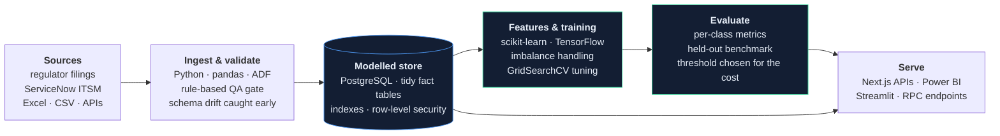

# Devesh Ojha

### AI &amp; Data Engineer · Calgary, AB
**I build models and the data infrastructure they depend on — the part most models never survive.**
Four years inside enterprise operational data, then two building ML systems and full-stack products end to end.

 

---

## The system I build, end to end

A model is the easy half. The half that decides whether it survives contact with reality is everything to its left and right — where the data comes from, whether you can trust it, what metric you actually optimise, and who consumes the output.

---

## Machine learning

Both of these are as much about **judgment as accuracy** — choosing the metric that matches the cost of being wrong, and saying plainly where the work falls short.

| Project | The engineering call | Result |
|---|---|---|
| **[Space Object Classification](https://github.com/Devesh0508/Space-Object-Classification)** Orbital elements → object type | Debris massively outnumbers rocket bodies, so accuracy rewards a model that predicts "debris" forever. Balanced with **SMOTE to 8,431/class**, benchmarked four algorithms under `GridSearchCV`, and read the result through **per-class precision and recall**. The linear-SVM-to-RBF jump (74.6% → 92.7%) is the real finding: the boundary in orbital-element space is non-linear. | **97.4%** held-out, Random Forest |
| **[Pediatric Pneumonia Detection](https://github.com/Devesh0508/Pediatric-Pneumonia-Detection)** Chest X-ray triage | In triage a false negative costs far more than a false alarm, so **recall is the objective, not accuracy**. VGG19 transfer learning because the dataset is far too small to learn filters from scratch; augmentation, BatchNorm, Dropout and EarlyStopping as the brakes on a high-capacity backbone. | **~88%** accuracy, VGG19 base |

Each README ends with **what I would do differently** — SMOTE belongs inside the CV fold, macro-F1 beats accuracy on a resampled set, a clinical model needs Grad-CAM and external validation before anyone trusts it. Knowing where your own work is weak is the difference between a benchmark and an engineer.

---

## Production systems

| Project | The hard part | Stack |
|---|---|---|
| **[CheaperRx](https://github.com/Devesh0508/cheaperrx)** · [live ↗](https://cheaperrx.vercel.app) Canadian prescription price comparator | **Authorisation lives in Postgres, not the app.** Row-level security on all eight tables, so a bug in a React component cannot leak another user's medication list. Stripe webhooks are the only writer of paid entitlement. Drug search runs on GIN full-text indexes rather than `LIKE` scans. | `Next.js 14` `TypeScript` `PostgreSQL` `Supabase` `Stripe` |

---

## Data engineering

| Project | The hard part | Stack |
|---|---|---|
| **[Alberta Oil Sands Analysis](https://github.com/Devesh0508/Alberta_Oil_Sands_Analysis)** Regulator filings → queryable model | Alberta's regulator publishes ST39 as a *document*: months across the page, commodities stacked down it. Unpivoting three annual workbooks into one tidy fact table — 9 operators × 36 months × 9 commodity streams — is what makes every measure a one-line aggregation. Findings are **reproducible from the committed dataset**, and the README states the grain defect I have not fixed yet. | `Python` `pandas` `Power BI` |
| **[HR Analytics Pipeline](https://github.com/Devesh0508/Python-Pipeline-for-Excel-Automation)** 12 hours/week of manual Excel, deleted | A **12-rule validation gate that fails loudly** instead of silently corrupting downstream reports — a pipeline that quietly accepts bad data is worse than the manual process it replaced. Streamlit front door so analysts self-serve. | `Python` `pandas` `Streamlit` |

> 🔎 **Try the data yourself** — [devesh0508.github.io](https://devesh0508.github.io#data) holds an interactive chart over the AER fact table my ETL produced. Pick an operator and the +15.5% figure above recomputes in your browser.

---

## Stack

**ML &amp; AI** &nbsp;`scikit-learn` &nbsp;`TensorFlow / Keras` &nbsp;`transfer learning` &nbsp;`SMOTE · imbalanced-learn` &nbsp;`GridSearchCV` &nbsp;`pandas · NumPy`

**Data &amp; platform** &nbsp;`PostgreSQL` &nbsp;`Azure Data Factory` &nbsp;`Supabase` &nbsp;`Power BI` &nbsp;`ServiceNow` &nbsp;`SQL Server`

**Languages** &nbsp;`Python` &nbsp;`SQL / T-SQL` &nbsp;`TypeScript` &nbsp;`DAX` &nbsp;`M / Power Query`

**Product &amp; infra** &nbsp;`Next.js 14` &nbsp;`Stripe` &nbsp;`Vercel` &nbsp;`Docker` &nbsp;`Streamlit` &nbsp;`Git`

---

## Background

**Independent builds &amp; analytics projects** — *Sep 2025 – present, Calgary AB*
Shipped **CheaperRx** end to end: schema, row-level security model, Stripe billing, SEO, deployment. Built the AER ST39 ETL and Power BI model now published with reproducible findings.

**Post-Baccalaureate Diploma, Applied Data Science** — *Thompson Rivers University, Sep 2023 – Sep 2025*
Full-time. Machine learning, statistical methods and applied data engineering; the pneumonia-detection and space-object projects were produced here.

**Business Analyst, Cognizant Technology Solutions** — *Jan 2020 – Jul 2023, client: John Deere IT Infrastructure*
Power BI semantic layer adopted by **8 Finance, Ops and IT teams**, cutting a three-day reconciliation to **four hours**. Azure Data Factory pipelines ingesting **70,000+ records per cycle**. Diagnosed a SQL aggregation defect distorting $50M+ investment reporting and cut metric variance **50%** in 30 days. Designed the **12-rule data quality framework** behind the HR pipeline above.

**B.Tech, Electronics &amp; Instrumentation Engineering** — *MAKAUT, 2015 – 2019*

**Certifications** &nbsp;Power BI Data Analytics *(Simplilearn)* &nbsp;·&nbsp; Modernizing Data Lakes &amp; Warehouses on Google Cloud *(Coursera)* &nbsp;·&nbsp; Azure AI Fundamentals AI-900 *(Microsoft)*

---

**Open to AI/ML Engineer, Data Engineer and Senior Analyst roles in Canada.**
Work authorised · based in Calgary · available immediately

