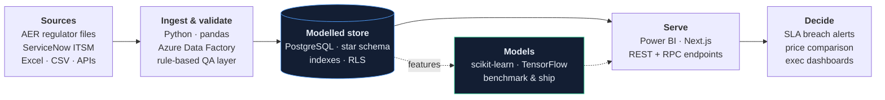

# Devesh Ojha

### Data & AI Engineer · Calgary, AB
**I build the whole path — ingestion, modelling, and the product that sits on top.**
Four years turning enterprise operational data into systems people run their week on. Now shipping full-stack, ML-backed products end to end.

 

---

## How I build

Most portfolios stop at the notebook. Mine go to the part where someone else depends on the output.

---

## Featured work

| Project | The hard part | Stack |
|---|---|---|
| **[CheaperRx](https://github.com/Devesh0508/cheaperrx)** · [live ↗](https://cheaperrx.vercel.app) Canadian prescription price comparator | Multi-tenant auth with **row-level security enforced in Postgres**, not app code. Drug autocomplete on GIN full-text indexes rather than `LIKE` scans. Stripe webhooks as the single source of truth for entitlement. | `Next.js 14` `TypeScript` `Supabase` `PostgreSQL` `Stripe` |
| **[Alberta Oil Sands Analysis](https://github.com/Devesh0508/Alberta_Oil_Sands_Analysis)** Regulator data → operator intelligence | Unpivoting three wide, human-readable regulator workbooks into one tidy fact table — 9 operators × 36 months × 9 commodity streams — then finding the signal: Gibson Energy **+15.5%** bitumen growth 2022–24, and May output running **13% below** the annual mean as turnarounds land. | `Python` `pandas` `Power BI` |
| **[HR Analytics Pipeline](https://github.com/Devesh0508/Python-Pipeline-for-Excel-Automation)** 12 hours/week of manual Excel, deleted | A **12-rule validation gate** that fails loudly instead of silently corrupting downstream reports, plus a Streamlit front door so analysts self-serve without touching code. | `Python` `pandas` `Streamlit` |
| **[Space Object Classification](https://github.com/Devesh0508/Space-Object-Classification)** Orbital telemetry → object type | Class imbalance was the whole problem, not the model. SMOTE to 8,431/class, then a tuned benchmark across four algorithms — **97.4%** on held-out data, read through per-class metrics rather than headline accuracy. | `scikit-learn` `imbalanced-learn` |
| **[Pediatric Pneumonia Detection](https://github.com/Devesh0508/Pediatric-Pneumonia-Detection)** Chest X-ray triage support | VGG19 transfer learning with augmentation and regularisation tuned for a **small, imbalanced clinical dataset** where recall matters more than accuracy. | `TensorFlow` `Keras` |

---

## Stack

**Languages** &nbsp;`Python` &nbsp;`SQL` &nbsp;`TypeScript` &nbsp;`DAX` &nbsp;`M / Power Query`

**Data & platform** &nbsp;`PostgreSQL` &nbsp;`Azure Data Factory` &nbsp;`Supabase` &nbsp;`Power BI` &nbsp;`ServiceNow` &nbsp;`Databricks concepts`

**ML & AI** &nbsp;`scikit-learn` &nbsp;`TensorFlow / Keras` &nbsp;`pandas · NumPy` &nbsp;`SMOTE · GridSearchCV` &nbsp;`RAG & LLM app patterns`

**Product & infra** &nbsp;`Next.js 14` &nbsp;`Stripe` &nbsp;`Vercel` &nbsp;`Docker` &nbsp;`Git`

---

## Day job

**Business Systems Analyst — Cognizant** *(John Deere IT Infrastructure)*
Twice-daily SLA reporting pipelines over ServiceNow ITSM data via Azure Data Factory; Power BI models built from scratch and adopted by **8 stakeholder teams**; a Python validation layer that cut reporting defects by **50%** and pulled a three-day reporting cycle down to **four hours**.

**Education** &nbsp;Post-Baccalaureate Diploma, Applied Data Science — *Thompson Rivers University* &nbsp;·&nbsp; B.Tech, Electronics & Instrumentation — *MAKAUT*

**Certifications** &nbsp;Power BI Data Analytics *(Simplilearn)* &nbsp;·&nbsp; Modernizing Data Lakes & Warehouses on Google Cloud *(Coursera)* &nbsp;·&nbsp; Azure AI Fundamentals AI-900 *(Microsoft)*

---

**Open to Data Engineer, AI/ML Engineer and Senior Analyst roles in Canada.**
Work authorised · based in Calgary · available immediately

